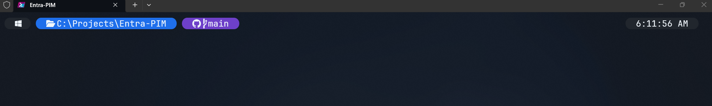

# GitHub Dark - Oh My Posh Theme

A minimal, GitHub-inspired [Oh My Posh](https://ohmyposh.dev/) theme with rounded bubble segments using GitHub's dark mode color palette.


## Preview



## Segments

| Segment | Color | Description |
|---------|-------|-------------|
| Windows icon | Dark gray (`#21262d`) | OS indicator |
| Path | Blue (`#1f6feb`) | Current directory (abbreviated) |
| Git branch | Purple (`#6e40c9`) | Branch name with GitHub logo |
| Git branch (dirty) | Red (`#da3633`) | Uncommitted changes |
| Git branch (ahead/behind) | Orange (`#9e6a03`) | Needs push or pull |
| Execution time | Dark (`#161b22`) | Shown when command takes >2s |

## Requirements

- [Oh My Posh](https://ohmyposh.dev/docs/installation/windows) v19+
- A [Nerd Font](https://www.nerdfonts.com/) (JetBrainsMono NF recommended)
- Windows Terminal (recommended)

## Installation

### 1. Install Oh My Posh

```powershell
winget install JanDeDobbeleer.OhMyPosh -s winget
```

### 2. Install a Nerd Font

```powershell
oh-my-posh font install JetBrainsMono
```

Then set your Windows Terminal font to **JetBrainsMono NF** in Settings > Profiles > Defaults > Appearance.

### 3. Download the theme

```powershell
New-Item -ItemType Directory -Path "$HOME\.config\oh-my-posh" -Force
Invoke-WebRequest -Uri "https://raw.githubusercontent.com/markorr321/github-dark-omp/main/github-dark.omp.json" -OutFile "$HOME\.config\oh-my-posh\github-dark.omp.json"
```

### 4. Add to your PowerShell profile

Open your profile:

```powershell
notepad $PROFILE
```

Add this line:

```powershell
oh-my-posh init pwsh --config "$HOME\.config\oh-my-posh\github-dark.omp.json" | Invoke-Expression
```

### 5. (Optional) Matching terminal color scheme

For the full GitHub Dark experience, add this color scheme to your Windows Terminal `settings.json`:

```json
{
    "name": "GitHub Dark",
    "background": "#0d1117",
    "foreground": "#c9d1d9",
    "cursorColor": "#58a6ff",
    "selectionBackground": "#163356",
    "black": "#0d1117",
    "red": "#f85149",
    "green": "#3fb950",
    "yellow": "#d29922",
    "blue": "#58a6ff",
    "purple": "#bc8cff",
    "cyan": "#39c5cf",
    "white": "#c9d1d9",
    "brightBlack": "#484f58",
    "brightRed": "#ff7b72",
    "brightGreen": "#56d364",
    "brightYellow": "#e3b341",
    "brightBlue": "#79c0ff",
    "brightPurple": "#d2a8ff",
    "brightCyan": "#56d4dd",
    "brightWhite": "#f0f6fc"
}
```

Then set `"colorScheme": "GitHub Dark"` in your profile defaults.

## Color Palette

All colors are sourced from [GitHub's Primer design system](https://primer.style/foundations/color):

| Color | Hex | Usage |
|-------|-----|-------|
| Dark gray | `#21262d` | OS segment background |
| Blue | `#1f6feb` | Path segment |
| Purple | `#6e40c9` | Git branch (clean) |
| Red | `#da3633` | Git branch (dirty) |
| Orange | `#9e6a03` | Git branch (ahead/behind) |
| Dark | `#161b22` | Execution time |

## Author

**Mark Orr** - [@markorr321](https://github.com/markorr321)

## License

MIT
